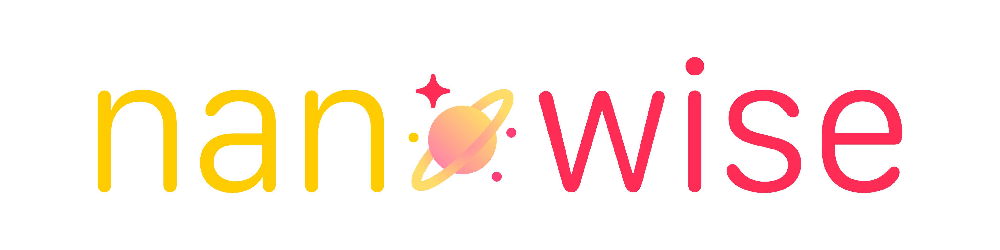
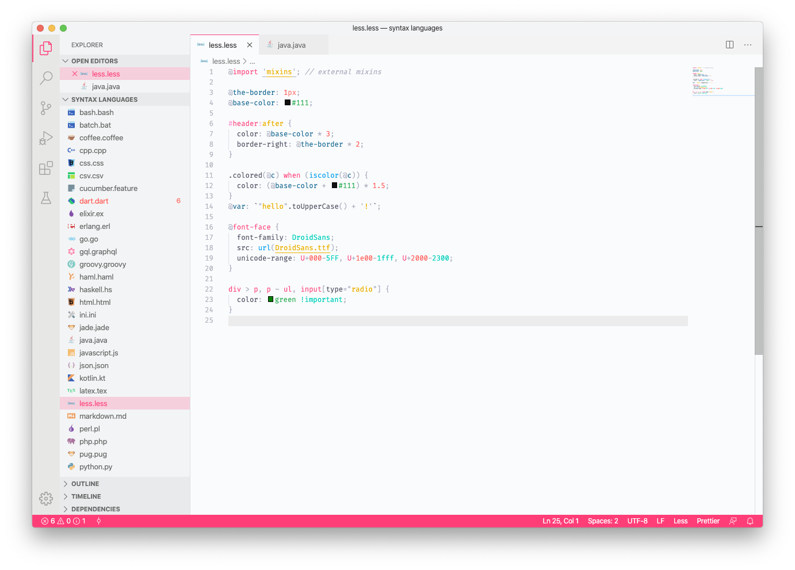
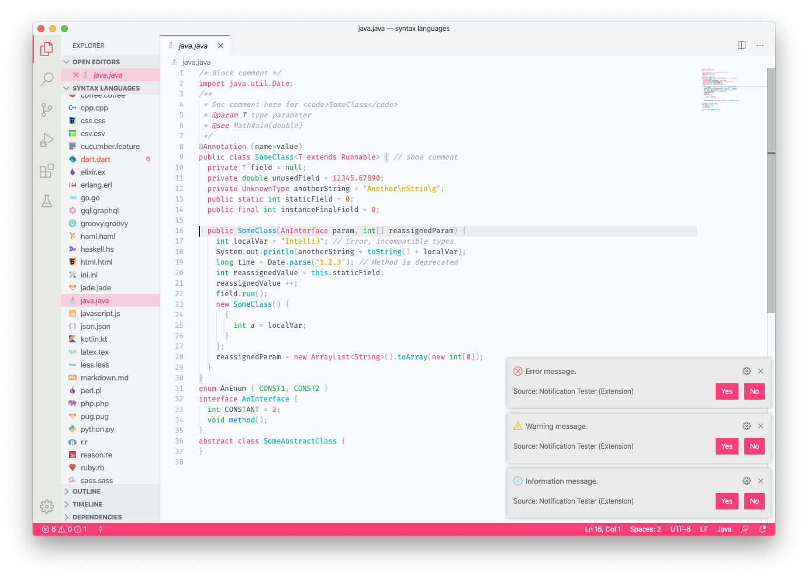
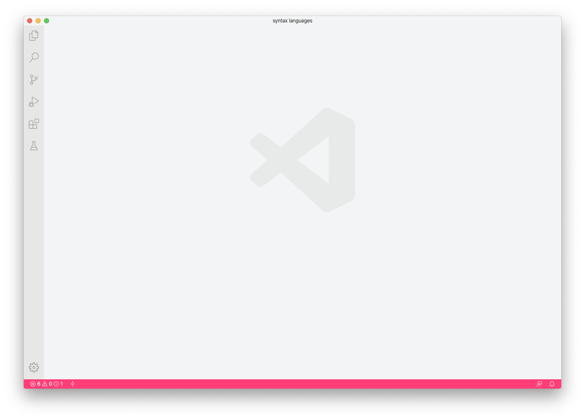
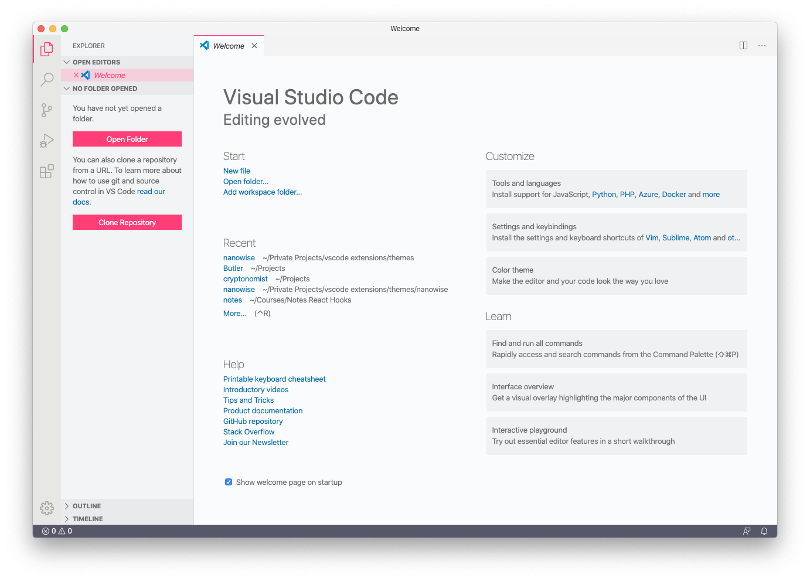

	

<h2 align="center">Nanowise</h2>

	
	
	
	  
	

---

	This is a punchy light theme for your editor. Initially I made this to learn more about creating my own VSCode theme.
     

## 📝 Table of Contents

- [About](#about)
- [Usage](#usage)
- [Built Using](#built_using)
- [Authors](#authors)
- [Acknowledgments](#acknowledgement)

## 🧐 About 

	

	
	
	
	

## 🎈 Usage 

Install the theme, apply it and enjoy!

## 👨‍💻 Built Using 

- [Visual Studio Code](https://code.visualstudio.com/) - Editor
- [Ext: Notification Tester](https://marketplace.visualstudio.com/items?itemName=svipas.notification-tester) - Extension
- [Ext: Readme Pattern](https://marketplace.visualstudio.com/items?itemName=thomascsd.vscode-readme-pattern) - Extension

## ✍️ Authors 

- [@istevkovski](https://www.linkedin.com/in/istevkovski/) - Creator of Nanowise

## 🎉 Acknowledgements 

- Thanks to [loilo's](https://github.com/loilo) for his [Snazzy Light](https://github.com/loilo/vscode-snazzy-light) theme, which was used as the base theme of this project!
- A hat tip to Umut for his [syntax-hightlighting-samples](https://github.com/uloco/syntax-highlighting-samples) as well.
